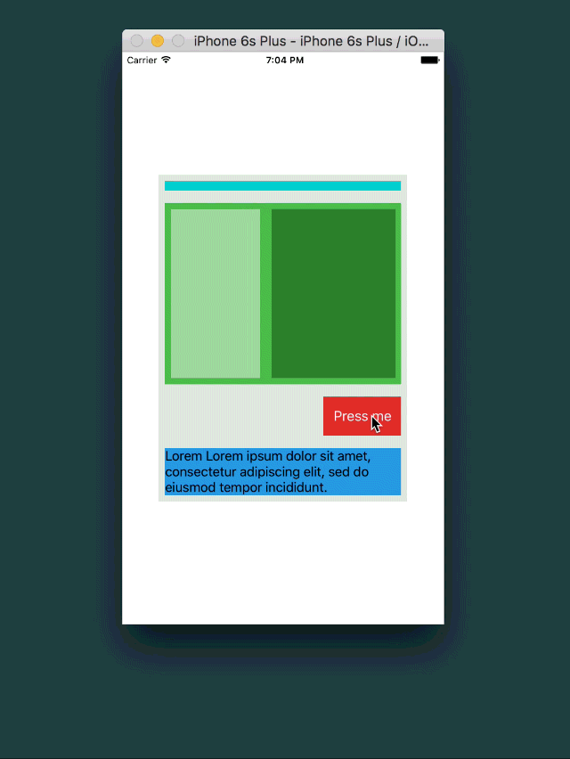

# FlexboxLayout
[](https://github.com/Carthage/Carthage)
[](#)
[](#)
[](https://opensource.org/licenses/MIT)

Port of Facebook's [css-layout](facebook css layout) to Swift + *UIView* extension.




This dynamic layout is expressed in code in the following declarative fashion:


```swift
     
override func viewDidLoad() {
     super.viewDidLoad()
     self.prepareViewHierarchy()
 }
 
 func prepareViewHierarchy() {
     
     self.treeView?.removeFromSuperview()
     
     let defaultMargin: Inset = (8.0, 8.0, 8.0, 8.0, 8.0, 8.0)
     
     self.treeView = UIView().configure({ (view, style) in
         view.backgroundColor = UIColor.a
         style.minDimensions = (DeviceScreen.HorizontalSizeClass() == .Regular ? 480 : 320, 420)
         style.flex = 1
         style.alignSelf = .Stretch
         
     }, children: [
         
         UIView().configure({ (view, style) in
             style.flex = 1
             style.alignSelf = .Stretch
             style.flexDirection = DeviceScreen.HorizontalSizeClass() == .Regular ? .Row : .Column

         }, children: [
         
             UIView().configure({ (view, style) in
                 view.backgroundColor = UIColor.b
                 view.hidden = self.toggle
                 style.minDimensions = (150,50)
                 style.justifyContent = .Center
                 style.alignSelf = .Stretch
                 style.margin = defaultMargin
             }),
             
             UIView().configure({ (view, style) in
                 view.backgroundColor = UIColor.c
                 style.minDimensions = (50,50)
                 style.flexDirection = .Row
                 style.flex = 1
                 style.margin = defaultMargin
                 style.flexDirection = DeviceScreen.HorizontalSizeClass() == .Regular ? .Column : .Row

                 }, children: [
                     
                     UIView().configure({ (view, style) in
                         view.backgroundColor = UIColor.d
                         style.flex = self.toggle ? 0.1 : 0.7
                         style.margin = defaultMargin
                     }),
                     
                     UIView().configure({ (view, style) in
                         view.backgroundColor = UIColor.e
                         style.flex = self.toggle ? 0.6 : 0.1
                         style.margin = defaultMargin
                     }),
                     
                     UIView().configure({ (view, style) in
                         view.backgroundColor = UIColor.d
                         style.flex = 0.1
                         style.margin = defaultMargin
                     })
                 ]),
             
             UIButton().configure({ (view, style) in
                 view.backgroundColor = UIColor.f
                 view.setTitle("Press me", forState: .Normal)
                 view.addTarget(self, action: "didPressButton:", forControlEvents: .TouchUpInside)
                 style.minDimensions = DeviceScreen.HorizontalSizeClass() == .Compact ? (250,50) : (100,50)
                 style.justifyContent = .FlexEnd
                 style.alignSelf = .FlexEnd
                 style.margin = defaultMargin
             })
             
         ]),
         
         UILabel().configure({ (label, style) -> Void in
             label.backgroundColor = UIColor.g
             label.numberOfLines = 0
             label.text = "Lorem Lorem ipsum dolor sit amet, consectetur adipiscing elit, sed do eiusmod tempor incididunt."
             style.margin = defaultMargin
         })
     ])
     
     self.view.addSubview(self.treeView!)
 }
 
 dynamic func didPressButton(sender: UIButton) {
     self.toggle = !self.toggle
     
     UIView.animateWithDuration(1) { () -> Void in
         self.render()
     }
 }

 override func viewDidLayoutSubviews() {
     render()
 }
 
 func render() {
     self.treeView!.render(self.view.bounds.size)
     self.treeView!.center = self.view.center
 }


```

Checkout the Demo project for further info.
